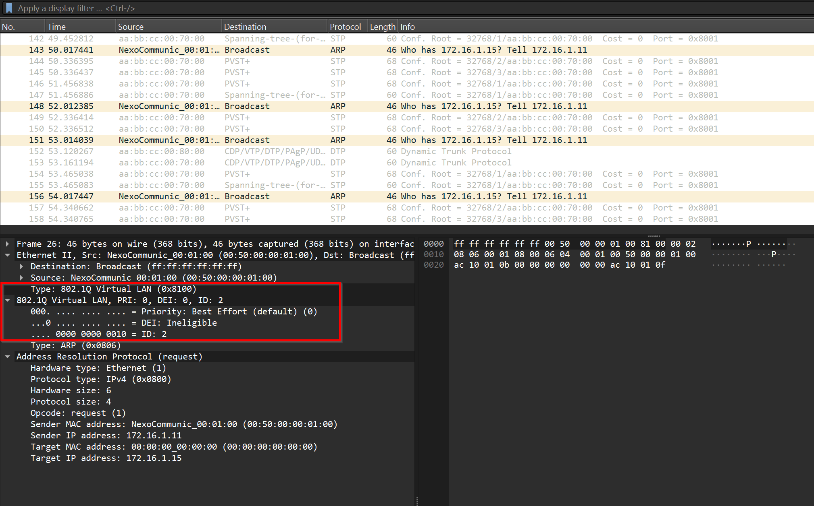
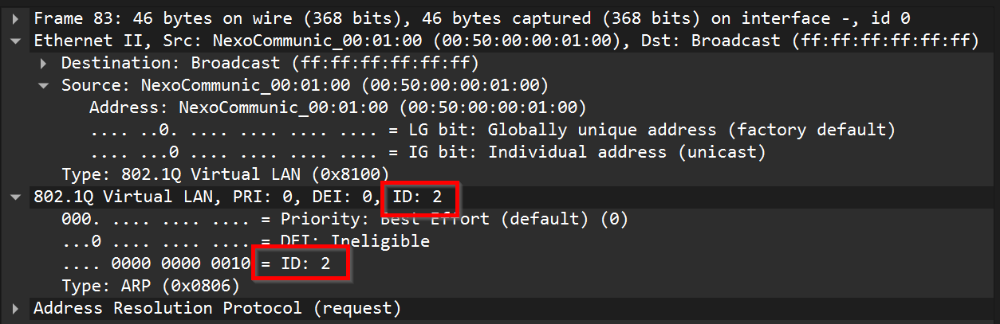
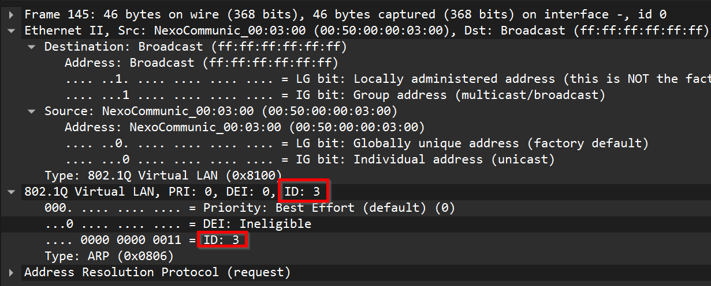
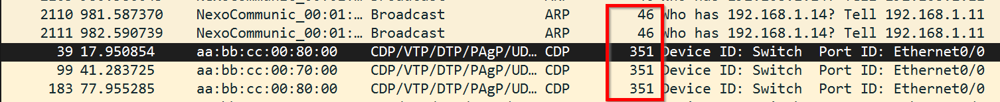
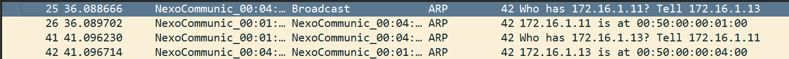
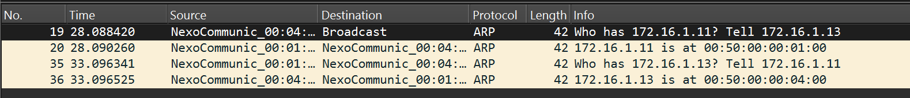

# SWR-lab2-VLAN
## 2 - Introduction aux VLANs

> 1. Donnez deux avantages concrets de l’utilisation des VLANs.

- Sécurité améliorée
- Les utilisateurs peuvent se déplacer sans changer de LAN.

> 2. Pour chaque affirmation, spécifiez si elle est vraie ou fausse : \
> a. Tous les membres d'un même VLAN sont dans le même domaine de broadcast. \
> b. Tous les membres d'un même VLAN sont dans le même domaine de collision. \
> c. Tous les membres d'un même VLAN doivent être connectés physiquement au même switch. \
> d. Tous les membres d'un même VLAN requièrent la capacité de travailler dans le mode full-duplex. 

a) Vrai
b) Faux
c) Faux
c) Faux

> 3. Quelle est la fonction du protocole 802.1Q (VLAN tagging) ?

Il ajoute un tag aux trames VLAN.

> 4. Une école d’ingénieurs dispose de deux VLANs : un VLAN ‘professeur-e-s’ et un VLAN ‘étudiant-e-s’. Comment est-il possible qu’étudiant accède au même serveur que son professeur ?

A l'aide d'un routeur les 2 VLAN peuvent communiquer

> 5. Décrivez brièvement le principe des VLAN par port.

Une machine se connecte par exemple au port 1 d'un switch qui appartient au VLAN 10. La machine sera donc connectée au 

> 6. Donnez deux inconvénients des VLAN par port. 

- Cela augmente la complexité de l'infrastructure.
- Un VLAN ne peut pas transmettre du traffic à un autre VLAN

## Configuration des ports access

> 8. Adapter ces mêmes commandes pour configurer le switch S2. Indiquer les commandes utilisées dans votre rapport.

```ios
Switch>enable
Switch#vlan database
% Warning: It is recommended to configure VLAN from config mode,
  as VLAN database mode is being deprecated. Please consult user
  documentation for configuring VTP/VLAN in config mode.

Switch(vlan)#vlan 1
VLAN 1 modified:
Switch(vlan)#vlan 2
VLAN 2 added:
    Name: VLAN0002
Switch(vlan)#vlan 3
VLAN 3 added:
    Name: VLAN0003
Switch(vlan)#exit
APPLY completed.
Exiting....
Switch#conf t
Switch(config)#inter
Switch(config)#interface e0/1
Switch(config-if)#swi
Switch(config-if)#switchport acce
Switch(config-if)#switchport access vlan 2
Switch(config-if)#exit
Switch(config)#interface e0/2          
Switch(config-if)#switchport access vlan 3
Switch(config-if)#exit
Switch(config)#interface e0/3          
Switch(config-if)#switchport access vlan 1
Switch(config-if)#exit
```

> 9. Testez la configuration sur S1. Depuis PC1, effectuez un ping sur une adresse IP 172.16.1.x inexistante. Quels PCs reçoivent la requête ARP ? Conclusion ?

Le seul PC à recevoir la requête ARP est le PC2. Le PC4 ne reçoit pas de requête car la liaison n'est pas faite entre les 2 switchs pour transmettre les VLANS.

## Configuration des ports trunk

> 11. Testez la configuration. Depuis PC1, envoyez un ping sur une adresse 172.16.1.x inexistante. Qui reçoit la requête ARP ? 

Tous les PCs du VLAN 1 reçoivent la requête ARP.

> 12. Analysez les trames échangées entre les deux switches. \
a) Indiquez l'emplacement et le format du 'VLAN tag' 802.1Q dans une trame Ethernet. \
b) Quel champ identifie le VLAN d'une trame ? \
c) Comparez deux trames de deux VLAN différentes pour vérifier vos propos. Attention : souvenez-vous que l'encapsulation 802.1Q n'a pas lieu sur tout le réseau.

a) Emplacement entouré en rouge dans l'image ci-dessous :  \
b) Le champ ID identifie le VLAN \
c) Trame du VLAN 2 :  \
Trame du VLAN 3 : 

> 13. Combien de VLANs différents peuvent être gérés avec l’encapsulation 802.1Q ?

4095 VLANs différents peuvent être gérés par 802.1Q

> 14. L’encapsulation 802.1Q est-elle également utilisée sur les ports access ? 

Non elle n'est pas utilisée sur les ports access. Elle est principalement utilisée sur les ports trunk.

> 15. Quelle est la longueur maximum d'une trame avec 802.1Q ? \
 a) Justifiez avec une capture Wireshark et comparez le résultat avec les trames sans 802.1Q. Grâce à l'option -s du ping, envoyez une trame d'une taille supérieure à 2000 bytes. La longueur de la trame affichée sur Wireshark (on wire) ne prend pas compte du CRC (+ 4bytes). \
 b) Expliquez comment un ping avec une payload plus grande que le maximum peut nous permettre de déterminer de manière rigoureuse la taille maximum d'une trame. (question bonus)

 a) La taille maximale d'une trame ARP est de 46 Bytes. Si nous la comparons à une trame CDP par exemple, cette dernière est d'une longueur de 351 Bytes.
  

b) Car les trames seront fractionnées en des fragments d'une longueur identique pour transmettre les données. De ce fait il est possible de déduire rigoureusement la MTU.

## 3 - Sécurité des VLANs
### ARP Spoofing

> 16. Depuis PC4, manipulez les caches ARP de PC1 et PC2 avec la commande suivante (en une seule ligne) :  
_sudo ifconfig eth0 172.16.1.12; (ping -c 1 172.16.1.11);  
sudo ifconfig eth0 172.16.1.11; (ping -c 1 172.16.1.12);  
sudo ifconfig eth0 172.16.1.13;_ 

> 17. Consultez la table ARP de PC1 et de PC2 pour en vérifier le contenu, à l’aide de la commande arp -a. Il se peut que le contenu s'e ace rapidement. Refaites la manipulation jusqu'à obtenir la MAC de PC4 dans la table de PC1 et PC2. Joignez des captures d'écran.

Nous constatons que l'adresse MAC ci-dessous correspond à celle de PC4.

Capture PC1


Capture PC2


### Attaque Man-In-The-Middle

> 18. Est-ce qu'un attaquant est capable d'effectuer une attaque man-in-the-middle avec la segmentation en VLANs s’il veut s’attaquer à un VLAN différent du sien ? 

Non ce n'est pas possible car il s'agit de réseaux différents.

### Attaque VLAN hopping 

> 19.  Renseignez-vous et décrivez en quoi consiste le VLAN hopping. 

Le VLAN hopping est une méthode d'attaque des VLAN consistant à envoyer des paquets à un port déconnecté. Le but étant d'accéder à d'autres VLANs du réseau.

> 20. Quelles attaques (écoute clandestine, déni de service) peuvent être menées avec cette méthode ? 

Nous pouvons faire de l'écoute clandestine avec cette méthode.

> 21. Proposez une approche pour empêcher cette attaque. 

Une solution pour éviter ce genre d'attaque est de désactiver le protocole STP sur tous les ports n'étant pas connectés à d'autres switchs.

## 4 - Recherche d'information et compréhension détaillée

> 22. Faites maintenant un ping depuis PC4 vers PC1 et capturez simultanément avec Wireshark à l’interface e0/0 de PC1 et e0/0 de PC4.  
Utilisez le filtre de capture ARP dans les deux captures. Dans une des deux interfaces, vous devriez voir seulement les requêtes ARP tandis que dans l’autre, vous devriez voir les requêtes et aussi les réponses ARP. Expliquez la raison. Pour ce faire, vous pouvez par exemple observer avec Wireshark le trajet parcouru par les requêtes ARP ainsi que celui des réponses ARP pour comprendre les différences entre les deux interfaces. 

Capture PC1


Capture PC4


Malgré plusieurs tests, nous obeservons les requêtes et les réponses des 2 côtés. Probablement car les swicths connaîssent déjà les emplacements des PC1 et PC4 en raison des pings effectués pour tester les mode trunk.

> 23. Faites un ping de PC1 vers PC6. Est-ce que le ping passe ? Si oui, pourquoi ? 

Non, car nous ne pouvons pas communiquer entre les VLANs sauf à l'aide d'un routeur.